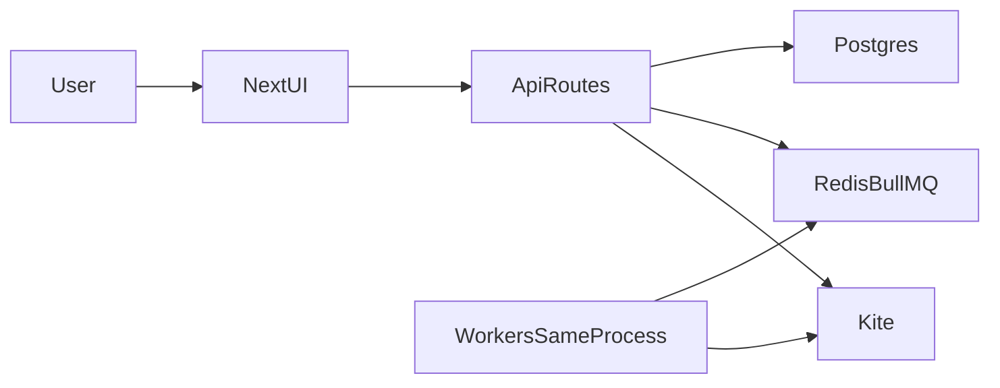

# Architecture

Kha-Ching is a **modular monolith**: Next.js UI + API routes, BullMQ workers in the same Node process, Postgres, Redis.

## Components

- `pages/` — UI and API
- `lib/strategies/` — entry
- `lib/exit-strategies/` — SL and square-off
- `lib/queue-processor/` — BullMQ workers
- `lib/schema.ts` — Drizzle tables

## P&L

- **Rupees:** `qty × average_price` (gross). Shown in the UI via `/api/pnl`.
- **Points:** signed fill prices per symbol. Used by max profit/loss (`lib/targetPnL.ts`). Unchanged on purpose.

## Auth

Kite OAuth → encrypted cookie (`iron-session`). Client `/api/user` never returns access tokens.

## Database

See `lib/schema.ts`. Unique `transactions.order_id`. `cleanup_old_records()` prunes old tokens and EMA, not `job_executions`.
