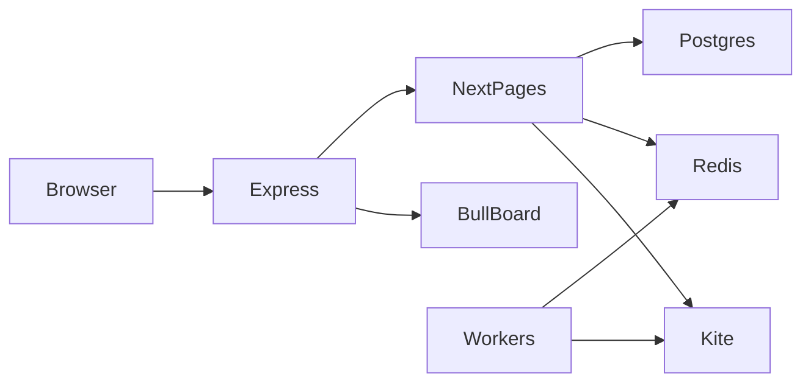

# Architecture

Kha-Ching is a **modular monolith**: one Node process serves the website, the API, and the background workers.

## Why a custom `server.js`?

Next.js API routes handle HTTP (login, plans, P&amp;L). **BullMQ workers** must stay alive all day. They are started as side-effects when `lib/session.ts` loads (`queue-processor`, `exit-strategies`, `watchers`). Express also mounts Bull Board at `/queues` behind the same login cookie.

If you run only `next start`, you lose that glue.

## Request path: Kite login

1. Browser `GET /api/login` → if no cookie, redirect to Zerodha.
2. Zerodha redirects to `/api/redirect_url_kite?request_token=...`.
3. Server calls Kite `generateSession` (HTTPS to Zerodha) with `KITE_API_SECRET`.
4. A **small** session payload is stored in an encrypted cookie (`iron-session`). Access tokens are **not** returned by `GET /api/user`.
5. If this is the first token of the IST day, the server stores it in `accesstoken` and schedules ancillary / chase / square-off jobs. Failures there must **not** fail login.
6. Browser goes to `/dashboard`.

Local HTTP: cookie `Secure` flag is off (`SESSION_COOKIE_SECURE=false`). Production HTTPS: `Secure` on.

## Queues (Redis)

Queue names include your `KITE_API_KEY` as a suffix so two API keys on one Redis stay separate.

| Queue | Job |
|---|---|
| `tradingQueue_*` | Place entry orders |
| `exitTradingQueue_*` | Stop-loss / exit |
| `autoSquareOffQueue_*` | Time-based square-off |
| `ancillaryQueue_*` | Orderbook sync to DB |
| `targetPnlQueue_*` | Max profit / max loss (points) |
| `chaseQueue_*` | EMA + chase SL updates |

Workers live in `lib/queue-processor/`.

## Database

Postgres. Schema in `lib/schema.ts`. Applied by `scripts/migrate.mjs` from `drizzle/*.sql`.

| Table | Purpose |
|---|---|
| `trade_plans` | Saved strategies per weekday |
| `job_executions` | Each scheduled/live job (kept for audit) |
| `transactions` | Completed orders; `order_id` unique |
| `accesstoken` | Latest Kite token for the IST day |
| `ema` | Chase EMA snapshots |
| `chase_status` / `chase_log` | Chase state |

`cleanup_old_records()` deletes old tokens and EMA rows, **not** `job_executions`.

## P&amp;L (two metrics)

- **Rupees:** `quantity × average_price` (gross). `/api/pnl` and the dashboard chip.
- **Points:** signed option prices used by `lib/targetPnL.ts` for max profit/loss. Intentionally not qty-weighted.

## UI

- `pages/` — Pages Router (`dashboard`, `plan`, `profile`, `strat/[strategy]`)
- `components/trades/` — straddle / strangle forms
- `src/theme.js` — MUI theme

## Instruments and lots

Kite instruments are fetched and memoized for hours (`lib/kiteUtils.ts`). Strangle lot size prefers live Kite `lot_size`. Fallback constants (Jan 2026 NSE): Nifty 65, BankNifty 30, FinNifty 60. Weekly expiry UI is **Nifty only**.
