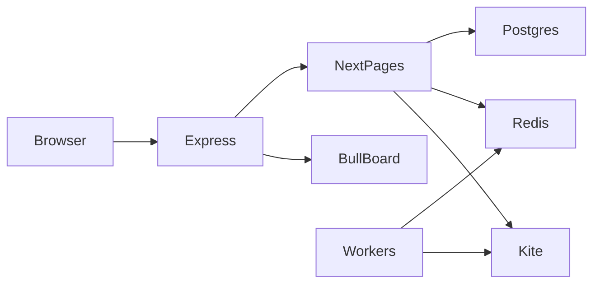

# Architecture

Kha-Ching is a **modular monolith**: one Node process serves the website, the API, and the background workers.

## Why a custom `server.js`?

Next.js API routes handle HTTP (login, plans, P&amp;L). **BullMQ workers** must stay alive all day. They are started as side-effects when `lib/session.ts` loads (`queue-processor`, `exit-strategies`, `watchers`). Express also mounts Bull Board at `/queues` behind the same login cookie.

If you run only `next start`, you lose that glue.

## Frontend

| Layer | Technology |
|-------|------------|
| Framework | Next.js 16 Pages Router |
| UI | Material-UI 5, Emotion |
| Data fetching | SWR 2 + `fetchJson` |
| Auth gate | `lib/useUser.ts` → `/api/user` |
| Timezone | Asia/Kolkata (`TZ` env) |

### Pages

| Route | File | Purpose |
|-------|------|---------|
| `/` | `pages/index.js` | Login landing |
| `/dashboard` | `pages/dashboard.js` | Today's jobs, new trade links, weekday plan runner |
| `/plan` | `pages/plan.tsx` | Weekday straddle/strangle templates |
| `/chase` | `pages/chase.tsx` | Single Chase config (not weekday-based) |
| `/strat/straddle` | `pages/strat/[strategy].js` | Punch-now ATM straddle |
| `/strat/strangle` | `pages/strat/[strategy].js` | Punch-now ATM strangle |
| `/profile` | `pages/profile.tsx` | Read-only broker profile |
| `/help`, `/help/[topic]` | `pages/help/*` | In-app guides |
| `/desk` | `pages/desk.tsx` | Ledger + risk halt/resume |
| `/queues` | Express (`server.js`) | Bull Board (session required) |

## Authentication

- **Library:** iron-session 8
- **Cookie:** `khaching-kite-session` (`SESSION_COOKIE_NAME`)
- **Password:** `SECRET_COOKIE_PASSWORD` (≥32 chars)
- **TTL:** until next 7 AM IST
- **Secure flag:** `SESSION_COOKIE_SECURE` or inferred from `NEXT_PUBLIC_APP_URL`

### Login flow

1. `GET /api/login` → Kite OAuth or `/dashboard` if session exists
2. Kite → `/api/redirect_url_kite?request_token=...`
3. `generateSession` → encrypted cookie (small payload; token not exposed on `/api/user`)
4. First token of IST day → `accesstoken` row + ancillary/chase/square-off scheduling (failures must not block login)
5. Redirect `/dashboard`

## API catalog

All routes except `/api/health` require session unless noted.

| Endpoint | Methods | Behavior |
|----------|---------|----------|
| `/api/health` | GET | Postgres + Redis check; 200 or 503 |
| `/api/login` | GET | OAuth redirect |
| `/api/redirect_url_kite` | GET | OAuth callback |
| `/api/user` | GET | Profile; destroys session on invalid Kite token |
| `/api/logout` | * | Destroy session |
| `/api/revoke_session` | * | Destroy session (no desk kill) |
| `/api/plan` | GET/POST/PUT/DELETE | Weekday templates; 409 on duplicate `(day, strategy)` |
| `/api/plan/copy` | POST | Copy template to other weekdays |
| `/api/strategy-defaults` | GET/PUT | Master defaults (not Chase) |
| `/api/chase-settings` | GET/PUT/POST | Chase config; POST `action:reset` |
| `/api/trades_day` | GET/POST/PUT/DELETE | Job CRUD + BullMQ enqueue |
| `/api/get_job` | GET | BullMQ job state |
| `/api/delete_job` | POST | Remove queued job |
| `/api/kill-desk` | POST | Emergency flatten (`intraday` \| `all`) |
| `/api/get_orders` | GET | Kite orders by `order_tag` |
| `/api/order_history` | GET | Kite order history by `id` |
| `/api/positions` | GET | Kite MIS positions |
| `/api/pnl` | GET | Dual P&amp;L by `order_tag` |
| `/api/desk/portfolio` | GET | Ledger portfolio + daily sessions |
| `/api/desk/orders` | GET | Persisted order blotter |
| `/api/desk/positions` | GET | Attributed positions |
| `/api/desk/trades` | GET | Round-trip trades |
| `/api/desk/activity` | GET | Decisions, audit, recon events |
| `/api/desk/alerts` | GET/DELETE | Operator failures; DELETE `{ period }` hides rows |
| `/api/desk/signals` | GET/DELETE | Persisted Chase/skew evaluations; DELETE `{ period }` removes rows |
| `/api/desk/reconcile` | POST | Sync ledger with Kite (does not place orders) |
| `/api/desk/risk` | GET/PUT/POST | Risk limits; POST `halt` \| `resume` |

Trading ledger docs: [TRADING_DOMAIN_MODEL.md](./TRADING_DOMAIN_MODEL.md). Risk: [TRADING_RISK_AUDIT.md](./TRADING_RISK_AUDIT.md).

### Common HTTP status codes

| Code | When |
|------|------|
| 401 | Missing session |
| 400 | Validation (scope, missing params) |
| 404 | Plan not found |
| 409 | Duplicate weekday plan |
| 405 | Wrong HTTP method |
| 500 | Unhandled exception |
| 503 | Health degraded |

## Queues (Redis)

Queue names include `KITE_API_KEY` as suffix for isolation.

| Queue | Role |
|-------|------|
| `tradingQueue_*` | Entry orders (straddle/strangle) |
| `exitTradingQueue_*` | Stop-loss / exit |
| `autoSquareOffQueue_*` | Time-based square-off |
| `ancillaryQueue_*` | Orderbook sync to DB |
| `targetPnlQueue_*` | Max profit/loss (**points**) |
| `chaseQueue_*` | EMA calc, signals, SL updates |

Workers: `lib/queue-processor/`. Stale jobs (scheduled date ≠ today) are discarded in `tradingQueue`.

## Watchers (in-process)

| Watcher | Role |
|---------|------|
| `slmWatcher` | Re-exit if exchange cancels SL-M |
| `sllWatcher` | Convert stuck SL-L to market after 30s |

## Database

Postgres via Drizzle (`lib/schema.ts`). Migrations in `drizzle/`.

| Table | Purpose |
|-------|---------|
| `trade_plans` | Weekday templates; unique `(day_of_week, strategy)` |
| `chase_settings` | Single-row Chase config |
| `strategy_defaults` | Master JSON per strategy |
| `job_executions` | Scheduled/live jobs (audit; not daily-deleted) |
| `transactions` | Completed orders (`order_id` unique) |
| `accesstoken` | Daily Kite token |
| `ema`, `chase_status`, `chase_log` | Chase engine state |
| `orders`, `order_events`, `fills` | Local order book and executions |
| `positions`, `position_events`, `trades` | Attributed book and round-trips |
| `trading_decisions`, `audit_events` | Why we acted |
| `strategy_signals` | Persisted Chase/skew/strike evaluations (Desk → Signals) |
| `operator_feed_clears` | Hide Alerts without deleting ledger/audit |
| `portfolio_snapshots`, `daily_sessions` | Equity, drawdown, session stats |
| `reconciliation_events` | Ledger vs Kite disagreements |

See [TRADING_DOMAIN_MODEL.md](./TRADING_DOMAIN_MODEL.md). `transactions` remains the legacy EOD archive.

## P&amp;L (two metrics — do not merge)

- **Rupees:** qty × price (`lib/pnl.ts`, `/api/pnl`, dashboard)
- **Points:** signed option prices for `lib/targetPnL.ts` (not lot-weighted)

## Strategies

| Strategy | Module | Notes |
|----------|--------|-------|
| ATM Straddle | `lib/strategies/atmStraddle.ts` | Skew gate, optional hedge |
| ATM Strangle | `lib/strategies/strangle.ts` | Strike selection modes |
| Subscribe & Chase | `lib/chaseSignal.ts` | Nifty futures NRML; hourly EMA |

### Known partial features

- Exit queue implements `INDIVIDUAL_LEG_SLM_1X` only; other exit enums appear in UI but are unwired in `exitTradingQueue.ts`
- Strangle form may list FinNifty while punch-now page restricts indices
- `runNow` market-open check is commented out in `pages/api/trades_day.ts`

## Environment variables

| Variable | Required | Purpose |
|----------|----------|---------|
| `DATABASE_URL` | Yes | Postgres |
| `REDIS_URL` | Yes | BullMQ |
| `KITE_API_KEY` / `KITE_API_SECRET` | Yes | Kite + queue suffix |
| `SECRET_COOKIE_PASSWORD` | Yes | Session encryption |
| `TZ` | Yes | `Asia/Kolkata` |
| `MOCK_ORDERS` | Recommended | Default true; this process never calls Kite `placeOrder`. Live also needs Desk allow-live + per-strategy Live |
| `SESSION_COOKIE_SECURE` | Local HTTP | `false` for http:// |
| `NEXT_PUBLIC_*` | Optional | Form defaults |
| `SLACK_WEBHOOK_URL` | Optional | Chase alerts |
| `OTEL_*` | Optional | Grafana Cloud logs |

## Market simulation

Reusable desk lab (not a PnL backtester): `lib/clock.ts`, `lib/marketCalendar.ts`, `lib/simulation/`. Run `yarn sim-test` or `yarn simulate -- --scenario normal-day`. Docs: [TRADING_SIMULATION_ARCHITECTURE.md](./TRADING_SIMULATION_ARCHITECTURE.md), [TRADING_SIMULATION_GUIDE.md](./TRADING_SIMULATION_GUIDE.md).

## External integrations

- **Zerodha Kite Connect** — `lib/kiteUtils.ts`, `lib/broker.js`
- **Redis** — BullMQ
- **Postgres** — Drizzle ORM
- **OpenTelemetry** — optional via `otel.js`
- **Slack** — optional webhooks

## Error handling

- API routes: per-handler try/catch; JSON `{ error }` on 500
- Kite retries: `withRemoteRetry` (`lib/remoteRetry.ts`); 401/TokenException throws immediately
- Job POST failure after DB insert → status `REJECT`
- Login queue scheduling errors logged but login succeeds

See also [TESTING_STRATEGY.md](./TESTING_STRATEGY.md) and [TEST_COVERAGE.md](./TEST_COVERAGE.md).
