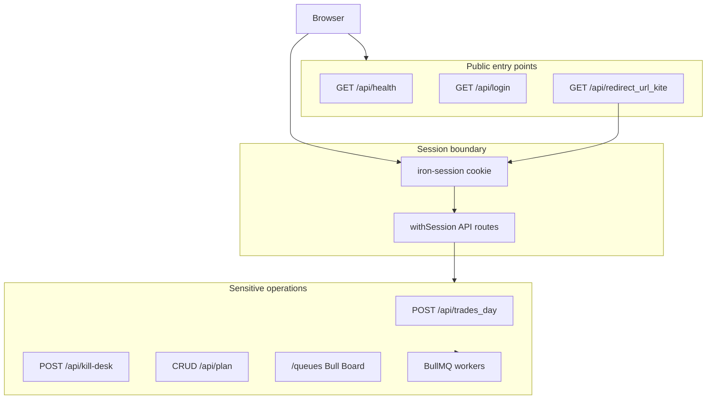

# Security review — kha-ching

Personal single-operator algorithmic trading desk for Indian index options via Zerodha Kite Connect. This document describes assets, trust boundaries, threats, and mitigations. For individual findings and remediation status see [SECURITY_FINDINGS.md](SECURITY_FINDINGS.md).

## Assets

| Asset | Location | Impact if compromised |
|-------|----------|------------------------|
| Kite access token | Encrypted iron-session cookie + `accesstoken` table | Full broker API access for the linked account |
| Session secret | `SECRET_COOKIE_PASSWORD` | Forged sessions, token theft |
| Trade plans / jobs | PostgreSQL (`trade_plans`, `job_executions`) | Unauthorized trades, desk disruption |
| Queue payloads | Redis (includes session user + token) | Broker access, job manipulation |
| Operator identity | Kite OAuth | Wrong account logging in on exposed instance |

## Trust boundaries



**Authorization model:** Binary session gate. There are no roles, no per-row `user_id`, and no multi-tenant RBAC. Any valid session can operate the full desk. Mitigations for wrong-account or internet exposure are **network placement**, **`ALLOWED_KITE_USER_ID`**, and **rate limiting**.

## Threats and mitigations

| Threat | Mitigation |
|--------|------------|
| Unauthorized OAuth login | `ALLOWED_KITE_USER_ID` required in production (`lib/authPolicy.ts`) |
| Mass assignment on job create | Allowlisted mapper (`lib/jobExecutionMapper.ts`) |
| Arbitrary job status / override | PUT `/api/trades_day` ABORT-only; no direct `status` |
| Unauthenticated queue admin | Bull Board behind session on `server.js`; standalone script localhost + auth |
| Raw error leakage | `lib/apiErrors.ts` — generic messages in production |
| OAuth / destructive API abuse | In-memory rate limiter on sensitive paths (`lib/rateLimit.js`, `server.js`) |
| Health endpoint disclosure | Optional `HEALTH_CHECK_TOKEN` bearer / header |
| Weak input on Chase / defaults | `validateChaseSettings`, `validatePlanConfig` |
| XSS / SQLi / SSRF | React escaping; Drizzle parameterization; no user-controlled outbound URLs |
| Dependency vulnerabilities | `yarn npm audit` in CI |

## Session and cookies

- Cookie name: `khaching-kite-session`
- `refresh_token` is **not** stored in session (access token only)
- `Secure` cookies default when `NEXT_PUBLIC_APP_URL` is HTTPS
- Local HTTP/Docker: set `SESSION_COOKIE_SECURE=false`

## Residual risks

1. **Access token in cookie** — acceptable for single-user design after allowlist; server-only token storage would require broader refactor of workers and `kiteUtils`.
2. **SameSite=Lax** — sufficient for same-origin app; logout/revoke restricted to POST.
3. **In-memory rate limits** — per-process; use reverse-proxy limits for multi-instance production.
4. **Docker dev Postgres/Redis host ports** — convenience only; do not publish 5432/6379 on production VPS (see [DEPLOYMENT.md](DEPLOYMENT.md)).
5. **Paper vs live** — a strategy is live only if `MOCK_ORDERS=false`, Desk “Allow live orders”, and that strategy’s `executionMode=LIVE`. New/unknown strategies stay PAPER. Reconcile ignores PAPER/MOCK rows when comparing to Kite.

## Verification

```bash
docker compose up -d postgres redis
yarn lint && yarn unit-test && yarn migrate
yarn int-test && yarn api-test
yarn npm audit --environment production
```

Security-focused API tests: `__tests__/api/security.test.ts`.

## Related docs

- [SECURITY_FINDINGS.md](SECURITY_FINDINGS.md) — finding IDs SEC-01 … SEC-15
- [DEPLOYMENT.md](DEPLOYMENT.md) — production env and firewall
- [ARCHITECTURE.md](ARCHITECTURE.md) — queues and API map
