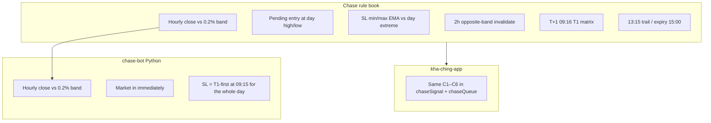

# Strategy implementation review

Three sources were compared:

1. **Operator Chase rule book** — Feb 2024 PDF of the published entry/exit rules. This is the **rule book** for Chase.
2. **chase-bot** — [docs/STRATEGY.md](https://github.com/ssnathan78/chase-bot/blob/master/docs/STRATEGY.md) plus the operator markdown *Chase Bot – Trend Following Logic & Behaviour.md*. This is a **Python rewrite** of “Pine + hourly poll”.
3. **This repo (kha-ching-app)** — `lib/chaseSignal.ts`, `lib/queue-processor/chaseQueue.ts`, `lib/ema.ts`, plus ATM straddle/strangle under `lib/strategies/`.

ATM straddle and strangle have **no external PDF**. Their spec is the code + [ATM_STRADDLE.md](./ATM_STRADDLE.md) / [ATM_STRANGLE.md](./ATM_STRANGLE.md). Chase is the only strategy with an external written rule book.

Severity:

| Tag | Meaning |
|---|---|
| **Blocking** | Would take a different trade than the rule book on a normal day |
| **Material** | Same idea, wrong level/time often enough to change P&amp;L |
| **Minor** | Rounding, labels, ops; rare expiry/edge cases |
| **Intentional** | Desk/product difference, documented |

---

## 1. Chase — verdict

**Kha-Ching is a close automation of the published Chase rule book**, not of chase-bot’s STRATEGY.md.

chase-bot’s STRATEGY.md is a **simplified (and in places incorrect) subset**: it keeps EMA(40)+HLC3 and ±0.2% bands, then **drops** day-high/low entries, pending-signal invalidation, T+1 T1 matrix, 13:15 trail, and expiry rollover. It also **redefines the stop** as `(EMA + prev day low/high) / 2` **at entry**. The rule book uses that midpoint **only on T+1**, and only in one of four 09:16 buckets.

If you treat chase-bot STRATEGY.md as the floor, Kha-Ching will look “over-specified.” If you treat the published rule book as the floor, chase-bot is the outlier.

---

## 2. Chase — rule book vs Kha-Ching

| Rule (published Chase rules) | This app | Severity |
|---|---|---|
| EMA(40) on HLC3, hourly | Yes (`lib/ema.ts`) | OK |
| Long if hourly close &gt; EMA+0.2% | Yes (`bufferPercent` 0.2 → `/100`) | OK |
| Short if close &lt; EMA−0.2% | Yes | OK |
| Entry = day’s high (ceil) / low (floor), **after** the signal, on a later bar | SL/MARKET at ceiled high / floored low; minute bars confirm | OK |
| Long SL = **lower** of day low and EMA | `Math.min(ema, lowestLow)` | OK (rounding) |
| Short SL = **higher** of day high and EMA | `Math.max(ema, highestHigh)` | OK |
| Invalidate pending if close beyond that SL | Yes | OK |
| Invalidate if 2 hours on the wrong 0.2% side | Flag `isSignalBreachingTolerance` then cancel next hour | **Minor**: needs two successful hourly jobs, not wall-clock 120 minutes |
| Do not move SL with T1 logic on **T-day** | 09:16 matrix keyed off `createdAt` vs previous trading day; 13:15 skipped if `createdAt` is today | OK |
| T+1 09:16 four buckets + CMP exit | Implemented in `processUpdateSL` | OK (see short-side PDF typos below) |
| Also adjust at **13:15** | EMA job at `:15` of hour 13 | OK |
| T1 0.4% only for that morning (and charts) | Hard-coded 1.004 / 0.996 in `updateSL` | OK |
| Expiry 15:00 roll to next month, SL = new EMA | Yes | OK |
| New signal **day before** expiry: enter **front** month, roll tomorrow | Day-before expiry is a normal session (one FUT). On **expiry day**, a still-flat book signals/enters **next** month; an open book rolls at 15:00 | **Intentional** — continuous Chase should not open the dying contract |
| One position; no pyramid | Status machine | OK |
| Hourly evaluation | 10:15–15:15 signals; 16:15 store-only | **Minor** vs “every hour including 09:15 close” — first signal bar is **10:15**, not 09:15/10:15 list in the article (article examples start 10:15) |

**Not copied (intentional ops):** Telegram, Prometheus, SQLite, Python `holidays` list. This desk uses Slack, Postgres, Desk alerts, Kite calendar.

**EMA seed:** Incremental EMA depends on accepting the previous row’s timestamp. If yesterday’s 16:15 row is missing but some older `ema` row exists, 10:15 **skips** (alert `CHASE_EMA_GAP`) rather than reseeding from history. First seed is only when that contract has **no** `ema` row.

**Instrument pick:** `instruments.length === 1 ? [0] : [1]` (`chaseSignal.ts`). Off expiry this is the only contract. On expiry day, while **flat**, new work is the next month so the book stays continuous. An open LONG/SHORT keeps `chase_status.tradingsymbol` until 15:00 rollover.

---

## 3. Chase — chase-bot STRATEGY.md vs the rule book (and vs this app)

chase-bot documents a bot that:

| chase-bot claim | Rule book | Kha-Ching | Severity of chase-bot vs rule book |
|---|---|---|---|
| Close vs ±0.2% → LONG/SHORT | Same | Same | OK |
| **Market** entry on the signal | Wait for day high/low break | Wait (SL-M / MARKET if already through) | **Blocking** |
| SL = `(EMA + prev day low)/2` stored **once at 09:15**, used **on every entry that day** | That midpoint is **one T+1 bucket**, not the entry SL | Entry SL = min/max(EMA, day extreme) | **Blocking** |
| T1 ±0.4% “informational only” | T1 **is** the 09:16 classification | Used at 09:16 | chase-bot **under-implements** |
| No pending state / 2h invalidate | Required | Implemented | **Blocking** if you run chase-bot as the published Chase rules |
| Sleep after 15:25; poll every 3600s | Hourly + 09:16 + 13:15 + 15:00 roll | Two schedulers (hourly EMA + minute SL) | chase-bot **missing** intraday SL management |
| Paper mode + outside-hours flag | n/a | Desk paper/mock | Intentional |

**Do not “fix” Kha-Ching to match chase-bot STRATEGY.md.** That would delete the actual Chase playbook. If Python chase-bot is still running anywhere, treat it as a **different, simpler strategy**.

Pine snippet in the operator markdown plots T1 SL at 09:15 and signal bands — it does **not** encode pending day-high entries. Kha-Ching followed the **article text and annotated charts**, which is the right source.

The rule book’s **prose** for short T+1 copies the long template (`EMA < close < Short T1`), which is **impossible** (Short T1 is below EMA). The **charts** and Kha-Ching use the mirror: `shortT1 ≤ close ≤ EMA` → midpoint of EMA and **previous day high**. Trust the charts + this code, not that one sentence.

---

## 4. ATM straddle / strangle — no PDF; code vs UI vs validation

These are **intraday option structures**. There was no attached straddle/strangle PDF. Review is **form + help + code**.

### What is correctly implemented

- ATM = nearest strike to spot; both legs MARKET; short vs long vol
- Straddle **skew wait** with time decay toward `thresholdSkewPercent`, then enter-or-reject
- Strangle **does not** use that skew wait (ATM helper forced expired + `takeTradeIrrespectiveSkew`)
- Distance / percent strike math is pure and tested
- Per-leg SL% + time square-off + point max loss/profit (straddle defaults)
- Rollback flatten on broken hedge/primary
- Live closed-market abort for straddle skew; strangle throws if closed after strike pick
- Independent risk engine in front of `placeOrder`

### Deviations / gaps (straddle & strangle)

| Issue | Severity | Notes |
|---|---|---|
| Combined SL, Supertrend, OBS trail | Closed | Hidden in the form; `validateExitStrategy` only allows `INDIVIDUAL_LEG_SLM_1X` and `NO_SL`. Saved plans coerce to per-leg SL |
| Strangle `STOP_LOSS_MARKET_ORDER` label | **Minor** | Orders are still MARKET |
| Inverted strangle symbols via `replace("CE","PE")` | **Minor / edge** | Can theoretically name a contract that does not exist if the chain is irregular |
| Strangle default form has **no** max loss/profit toggles | Intentional vs straddle | Point targets only if the job payload includes them |
| FinNifty on strangle | **Minor** | Help/form historically awkward; not Chase |
| Mock orders skip live `isMarketOpen` on straddle | Intentional | Documented in simulation guide |
| Dual P&amp;L (rupees vs points) | Intentional | Do not “fix” `targetPnL` to rupees |

None of these make a short ATM straddle into a different *strategy*; they are product/UI holes around a real short-vol implementation.

---

## 5. What to leave as-is

1. Leave chase-bot’s T1-first-SL-on-entry **out** of this codebase.
2. Do **not** force expiry-day new entries onto the front month: a flat book should take next-month futures.
